# Part 1. **Готовый докер**

- Взять официальный докер образ с nginx и выкачать его при помощи **docker pull**
- Проверить наличие докер образа через **docker images**
- Запустить докер образ через **docker run -d [image_id|repository]**


- Проверить, что образ запустился через **docker ps**

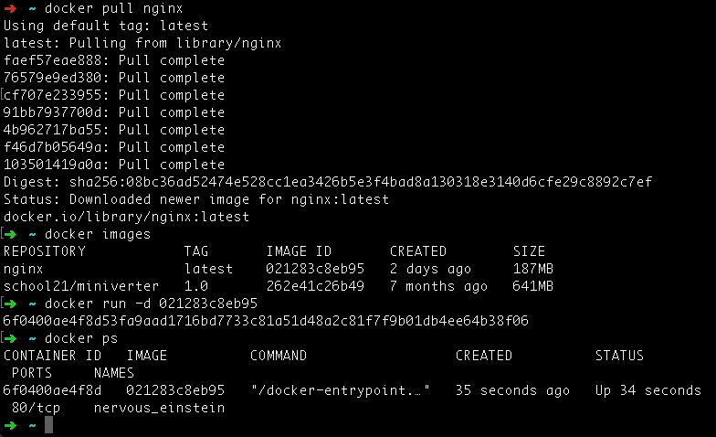

- Посмотреть информацию о контейнере через **docker inspect [container_id|container_name]**

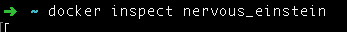

*По выводу команды определить и поместить в отчёт размер контейнера, список замапленных портов и ip контейнера*


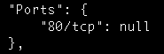

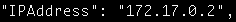

- Остановить докер образ через **docker stop [container_id|container_name]**

- Проверить, что образ остановился через **docker ps**

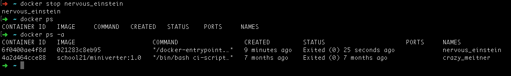

- Запустить докер с портами 80 и 443 в контейнере, замапленными на такие же порты на локальной машине, через команду **run**

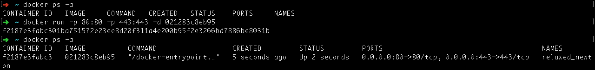

- Проверить, что в браузере по адресу **localhost:80** доступна стартовая страница **nginx**

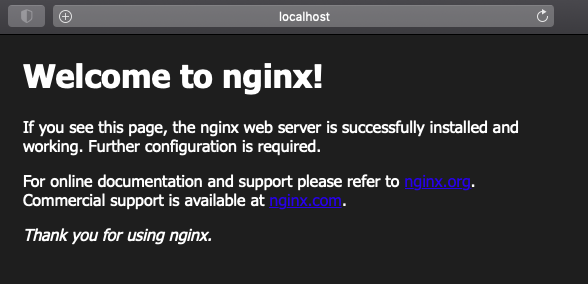

- Перезапустить докер контейнер через **docker restart [container_id|container_name]**
- Проверить любым способом, что контейнер запустился

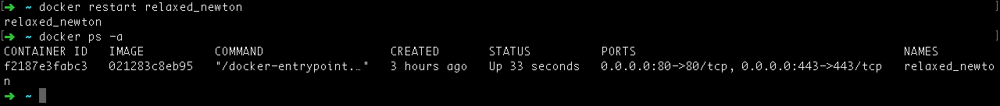

Полезные материалы: https://docs.docker.com/engine/reference/commandline/import/


# Part 2. **Операции с контейнером**

- Прочитать конфигурационный файл nginx.conf внутри докер контейнера через команду **exec**

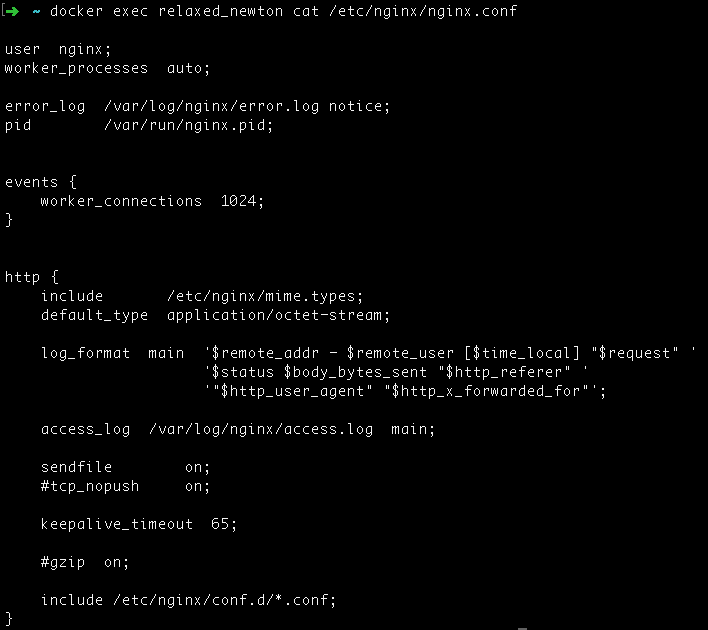

- Создать на локальной машине файл **nginx.conf**

- Настроить в нем по пути /status отдачу страницы статуса сервера **nginx**

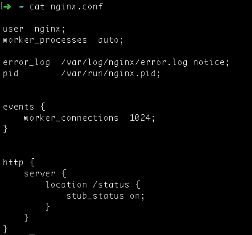

- Скопировать созданный файл nginx.conf внутрь докер образа через команду **docker cp**

- Перезапустить nginx внутри докер образа через команду **exec**

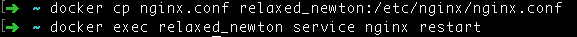

- Проверить, что по адресу **localhost:80/status** отдается страничка со статусом сервера nginx

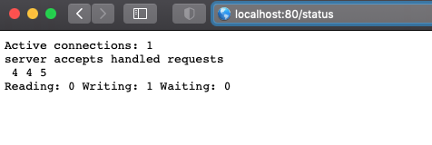

- Экспортировать контейнер в файл **container.tar** через команду **export**
- Остановить контейнер

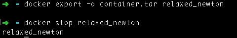

- Удалить образ через **docker rmi [image_id|repository]**, не удаляя перед этим контейнеры

- Удалить остановленный контейнер

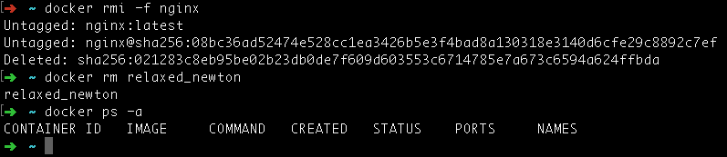

- Импортировать контейнер обратно через команду
```
 docker import -c 'cmd ["nginx", "-g", "daemon off;"]' -c 'ENTRYPOINT ["/docker-entrypoint.sh"]' container.tar nginx
```

`--change`, `-c` - Применить инструкцию Dockerfile к созданному образу 

`ENTRYPOINT` - Инструкция в Dockerfile используется для указания команды, которая должна выполняться при запуске контейнера. Эта инструкция предоставляет исполняемые файлы, которые всегда будут выполняться при запуске контейнера 

`CMD` - Команда в Docker используется для указания команды по умолчанию, которая должна выполняться при запуске контейнера Docker. Эта инструкция позволяет задать команду по умолчанию, которая будет выполняться только при запуске контейнера без указания команды  

`daemon off` - Указываем Nginx запускаться на переднем плане

`docker-entrypoint.sh` — это сценарий, который, обычно, используется в образах Docker для выполнения задач инициализации перед запуском основного процесса контейнера. Этот сценарий обычно указывается с помощью ENTRYPOINT инструкции в файле Dockerfile 

- Запускаем контейнер командой 
```
docker run -d -p 80:80 -p 443:443 IMAGE ID
```  
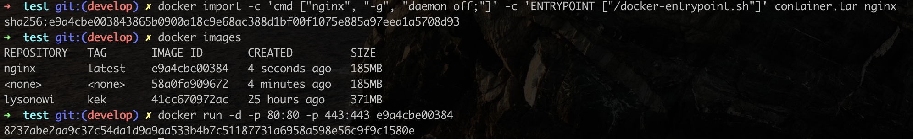

 - Проверить, что по адресу **localhost:80/status** отдается страничка со статусом сервера **nginx**

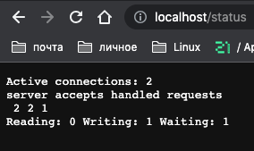

# Part 3. **Мини веб-сервер**

- Написать мини сервер на C и FastCgi, который будет возвращать простейшую страничку с надписью **Hello World!**

**FastCGI** - это протокол взаимодействия между веб-сервером и внешним приложением, который позволяет улучшить производительность веб-приложений. Вместо того, чтобы создавать и завершать процесс для каждого запроса, FastCGI поддерживает постоянное соединение между веб-сервером и FastCGI-программой, что позволяет более эффективно обрабатывать запросы.
 
Использование spawn-fcgi в Docker-контейнере позволяет запустить FastCGI-программу в контейнере и связать ее с веб-сервером, который работает на хостовой системе или в другом контейнере. Это обеспечивает изоляцию и управление процессом FastCGI-сервера внутри контейнера, что упрощает развертывание и масштабирование веб-приложений.

Полезные материалы: https://fastcgi-archives.github.io/FastCGI_Developers_Kit_FastCGI.html

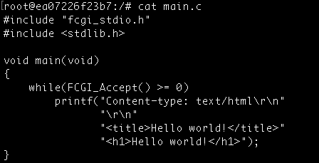


Для установки необходимых расширений выполним следующие команды:
```
apt update
apt install gcc
apt install spawn-fcgi
apt install libfcgi-dev
```


- Запустить написанный мини сервер через **spawn-fcgi** на порту 8080

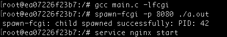

 При компиляции используем флаг **-lfcgi**, который позволяет компилятору найти и связать библиотеку FastCGI с программой, чтобы она могла использовать функции и структуры, определенные в этой библиотеке.

- Написать свой **nginx.conf**, который будет проксировать все запросы с 81 порта на **127.0.0.1:8080**

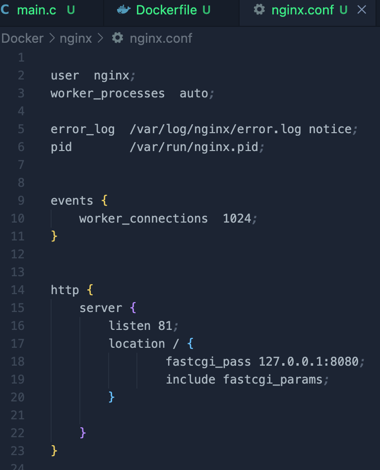

- Проверить, что в браузере по **localhost:81** отдается написанная вами страничка

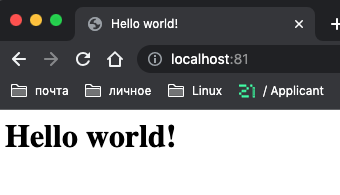

- Положим файл **nginx.conf** по пути ./nginx/nginx.conf (это понадобится позже)


# Part 4. **Свой докер**
Написать свой докер образ, который:
1) собирает исходники мини сервера на FastCgi из Части 3
2) запускает его на 8080 порту
3) копирует внутрь образа написанный ./nginx/nginx.conf
4) запускает nginx.
- Собрать написанный докер образ через docker build при этом указав имя и тег 
```
docker build -t lysonowi:kek .
```
- Проверить через **docker images**, что все собралось корректно

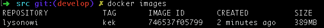
- Запустить собранный докер образ с маппингом 81 порта на 80 на локальной машине и маппингом папки ./nginx внутрь контейнера по адресу, где лежат конфигурационные файлы nginx'а 

```
docker run -v "$(pwd)/nginx/nginx.conf:/etc/nginx/nginx.conf" -p 80:81 -d IMAGE ID
```
Как подключить локальную директорию при помощи docker run -v: https://techrocks.ru/2022/05/03/mounting-local-directories-and-volumes-in-docker/ 

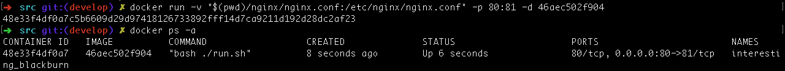

Полезные материалы: https://techrocks.ru/2022/05/03/mounting-local-directories-and-volumes-in-docker/

- Проверить, что по localhost:80 доступна страничка написанного мини сервера

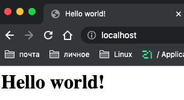

- Дописать в ./nginx/nginx.conf проксирование странички /status, по которой надо отдавать статус сервера nginx

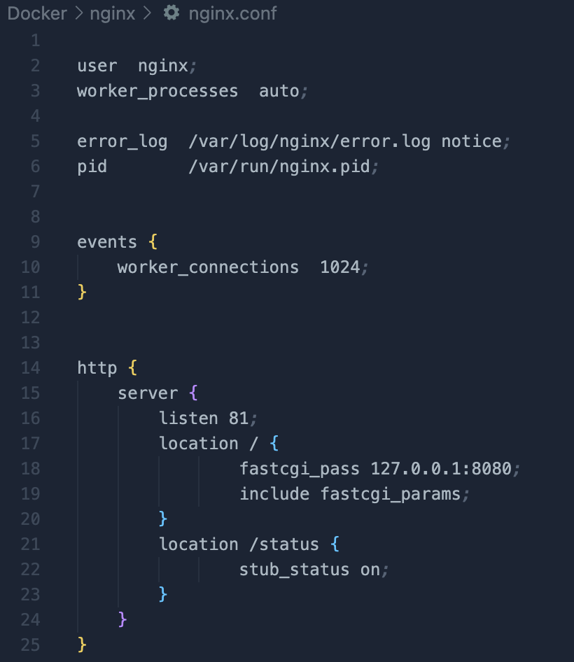

- Перезапустить докер образ

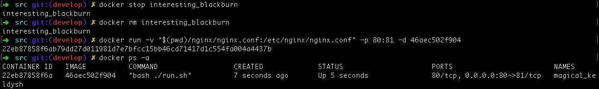

- Проверить, что теперь по localhost:80/status отдается страничка со статусом nginx

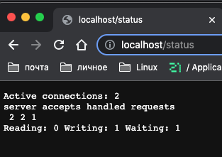

# Part 5. **Dockle**
Установим dockle командой **brew install dockle** или скачаем по ссылке: https://github.com/goodwithtech/dockle/releases

- Просканировать образ из предыдущего задания через **dockle [image_id|repository]**

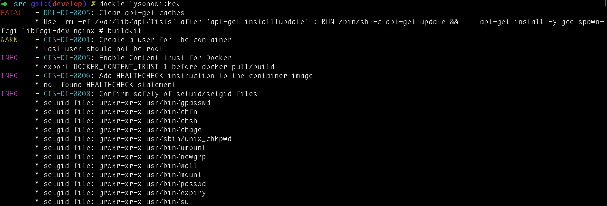

- Исправить образ так, чтобы при проверке через dockle не было ошибок и предупреждений


в Dockerfile добавим команды:

```
RUN rm -rf /var/lib/apt/lists && \
    useradd -d /home/dockle -m -s /bin/bash dockle
USER dockle
```

Заново собираем образ docker **build -t lysonowi:kek .** и просканируем образ: 


Добавим в команду **-i CIS-DI-0010**
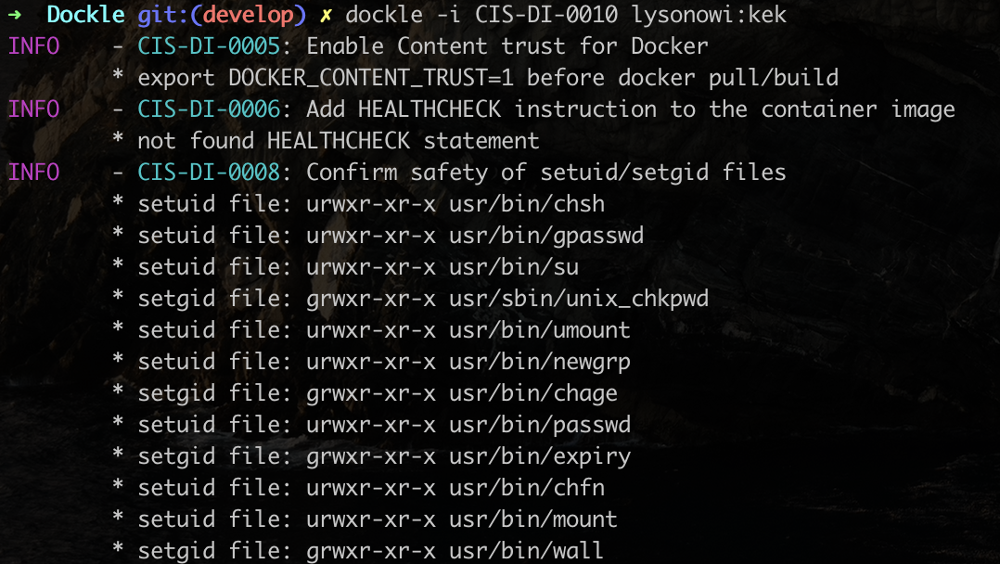

Проверим, что у нас все отображается корректно:
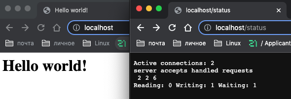

Create a user for the container: https://github.com/goodwithtech/dockle/blob/master/CHECKPOINT.md

# Part 6. **Базовый Docker Compose**

- Написать файл **docker-compose.yml**, с помощью которого:

1) Поднять докер контейнер из Части 5 (он должен работать в локальной сети, т.е. не нужно использовать инструкцию EXPOSE и мапить порты на локальную машину)

2) Поднять докер контейнер с nginx, который будет проксировать все запросы с 8080 порта на 81 порт первого контейнера

Замапить 8080 порт второго контейнера на 80 порт локальной машины

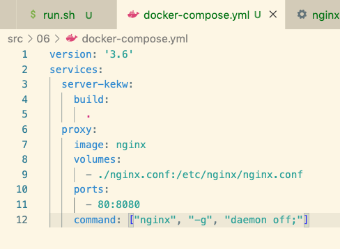

https://blog.devsense.com/2019/php-nginx-docker
https://www.theserverside.com/blog/Coffee-Talk-Java-News-Stories-and-Opinions/Docker-Nginx-reverse-proxy-setup-example

- Остановим все запущенные контейнеры и собререм и запустим проект с помощью команд **docker-compose build** и **docker-compose up**

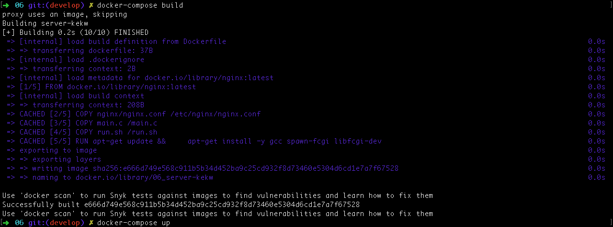

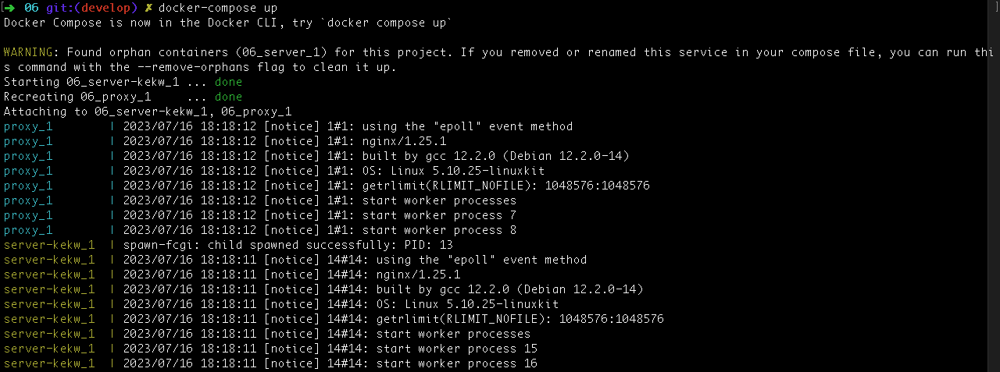

- Проверить, что в браузере по localhost:80 отдается написанная вами страничка, как и ранее

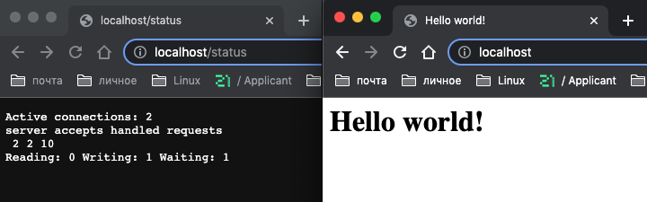

